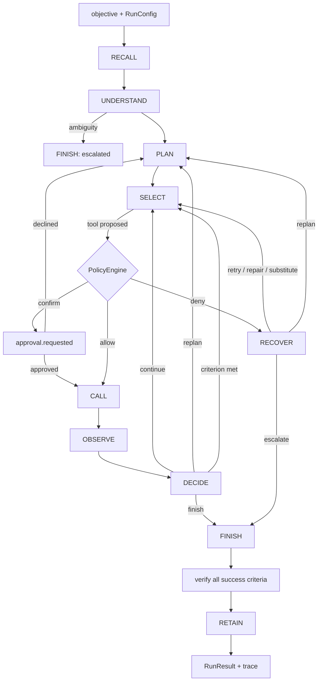

# DESIGN

## Shape

One objective per run, one pass through a fixed cycle, one structured event per transition.

Every arrow emits a `BrainEvent`. The trace is causal, not merely timestamped: the event reaches the
sink *before* the loop advances.

## Phased plan and actual status

| Phase | Deliverable | Status |
|---|---|---|
| 0 | Step 0 analysis, `UNDERSTANDING.md` | **done** — 4 analyst docs |
| 1 | `DESIGN.md`, `CONTRACTS.md` frozen, JSON Schemas | **done** |
| 2 | Vertical slice: config → assemble → LLM → tool → parse → loop → FINISH → RETAIN | written, **NOT executed** |
| a | Config loading + layering | written, not executed |
| b | Registry + mock adapters + provider registry | written, not executed |
| c | Assembler + soul/agents/profiles | written, not executed |
| d | Parser + repair ladder | written (`GroqClient` still missing) |
| e | Planner / recovery / policy / budgets | written, not executed |
| f | Events / trace / metrics | written, not executed |
| g | Tests + memory ON/OFF benchmark | written, not executed |
| h | Demo scenario + README | README done; demo script missing |

**Nothing in phases 2–g has been run.** The shell safety classifier was unavailable for essentially
the whole of both sessions, so no Python was executed, no test collected, and no config loaded. See
`BUILD_LOG.md`. That is the most important fact about this build's current state.

## MVP vs stretch — the cut line

**MVP (built).** Config layering, the tool registry with permission tiers, the assembler, the parser
with a repair ladder, the state machine with policy and budgets, memory attribution,
verify-before-finish, events, the benchmark, and a synthetic devops world rich enough to demo.

**Stretch (not built).** `GroqClient` against the live API; the `hindsight` real adapter; the
`conformance` suite; the config-reload HTTP API; the trace viewer UI; a demo script.

**Cut deliberately.** A settings-panel UI (a config reload endpoint plus the CLI covers the same
ground for a fraction of the time), any dashboard or chart beyond the trace, and a standalone demo app
— the run selector belongs in the trace viewer's rail. From `UI_NOTES.md`: the one non-negotiable UI
element is the trace viewer's **memory lane with influence connectors**, because it is the only thing
that visually proves the 25% criterion. Everything else is a log viewer.

## File ownership

One owner per file, which is what made parallel agents safe to dispatch. They were blocked by the
classifier outage; their briefs at `docs/brain/briefs/` remain executable as written.

| Area | Files | Owner |
|---|---|---|
| Contract | `brain/contracts.py`, `brain/errors.py`, `docs/brain/CONTRACTS.md`, `docs/brain/schemas/*` | orchestrator |
| Config | `brain/config/*`, `brain/providers/registry.py`, `brain/tools/{registry,validate}.py`, `brain/events/{emitter,sinks,compat}.py`, `brain/redact.py`, `brain/util/*`, `brain/cli.py`, `brain/docs/gen_tools_md.py` | foundation engineer |
| Loop | `brain/loop/*`, `brain/prompt/*` | core-loop engineer |
| LLM | `brain/llm/*`, `brain/providers/llm/*`, `brain/tools/executor.py`, `brain/tools/conformance.py` | LLM engineer |
| Fixtures | `brain/providers/mock/*`, `config/fixtures/**` | fixtures engineer |
| Tests | `tests/**` | test engineer (writes from the contracts, not the implementations) |

## Key decisions

Recorded in full in `BUILD_LOG.md`. The five that shape everything else:

1. **Synchronous loop.** A deterministic state machine, testable without event-loop fixtures; events
   go through an injected sink so an SSE layer can drive it from a threadpool.
2. **Raw `httpx`, not the `groq` SDK.** Handling malformed arguments requires owning the wire.
3. **`jsonschema` for both config and tool arguments.** One validation mechanism, one source of truth,
   no `pydantic`.
4. **Provider registry.** Capability → implementation by name, so mock → real is one line.
5. **Memory attribution is typed.** `explicit_citation` / `entity_overlap` / `lexical_overlap` render
   differently, because a trace that overstates a causal link is worse than one that shows nothing.

## Deliberate deviations from the brief, and why

- **`brain/loop/engine.py` is one module** rather than `machine.py` + `policy.py` + `planner.py`. The
  three share the plan, the budget counters and the step cursor; splitting them would have meant three
  files passing a context object around. Banner comments mark the seams.
- **`brain/providers/mock/devops.py` serves four capabilities** rather than one module each. They
  describe one coherent estate, and splitting them would make it impossible to keep a log timestamp
  consistent with the deploy it implicates. The documented `brain/providers/<capability>/<impl>.py`
  convention is still tried first, so a real adapter overrides the bundle with no other change.
- **No `pytest.ini` at the repo root.** `tests/conftest.py` inserts the repo root on `sys.path`
  instead, keeping our footprint out of a teammate's tree.
